# Sdf1系列登录插件使用说明

# 特别说明：本插件仅有简中语言版本，如需除简中以外的任何版本，请下载插件源码，自行修改！

## 1. 功能介绍

| 名字 | 描述/作用 | 施工状态 | 
| :---: | :---: | :---: |
| 登录 | 用户登录/注册 | 已完成 |
| 世界垃圾箱 | 清理服务器凋落物 | 已完成 |
| 工单系统 | 用户提交工单 | 已完成 | 
| 签到系统 | 签到积分换奖励 | 已完成 |
| 新人礼包 | 新玩家7日礼包 | 已完成 |
| 挂机检测 | 挂机检测踢出 | 已完成 | 
| 自定义菜单 | 可以自己diy指令 | 已完成 |
| 自定义菜单图标 | 可以用自己喜欢的物品当图标 | 已完工 |
| 商城系统| 内置游戏商人可供销售商品 | 已完工 |
| 虚拟货币 | 供签到、游戏商人使用的货币系统 | 已完工 |


## 2.安装说明：

| 前置插件 | 选装类型 |  功能作用 |
| :--- | :--- | :--- |
| [CY_beibao](https://git.ypshidifu.cn/youpaishidifu/CY_beibao) | 可选,推荐 | 云背包，积分商城可购买背包容量 |
| EssentialsX | 可选 | 主流经济系统 | 
| [sdf1](https://git.ypshidifu.cn/youpaishidifu/Sdf1_plugin) | 可选,推荐 | CDK兑换系统 |


### 2.1 下载
您可以从GitHub和Gitee、gitcode下载到插件，将其丢入服务器plugin目录，重启服务器即可。

### 2.2. 配置文件

#### 2.2.1 消息.txt
此文件控制着整个插件的所有提示消息，您可以根据自己的需求修改，修改后需要执行 /sdf1_login reload 重载插件。支持[颜色代码](https://zh.minecraft.wiki/w/%E6%A0%BC%E5%BC%8F%E5%8C%96%E4%BB%A3%E7%A0%81)<br>
同时兼容`<b> </b>`标签，对段落加粗，`\n 和 <br>`进行段落换行


```txt
# ==========================================
#      Sdf1_login 消息配置文件
# ==========================================
# 颜色代码使用 § 符号
#   §0黑色 §1深蓝 §2深绿 §3深青
#   §4深红 §5深紫 §6金色 §7灰色
#   §8深灰 §9蓝色 §a绿色 §b浅蓝
#   §c红色 §d粉色 §e黄色 §f白色
#   §l粗体 §n下划线 §o斜体 §r重置
#
# 占位符用 {xxx} 表示，运行时自动替换
# 支持 <b>粗体</b> 标签
# 支持 \n 或 <br> 换行
# 修改后执行 /sdf1_login reload 重载
# ==========================================

# ---- 登录注册相关 ----
# login_timeout: 登录超时被踢出时的提示
login_timeout=§c登录超时，请重新登录
# not_registered: 未注册玩家收到的提示
not_registered=§e您尚未注册，请使用 /reg <密码>
# not_logged_in: 已注册但未登录的提示
not_logged_in=§e您尚未登录，请使用 /login <密码>
# already_registered: 已注册玩家再次注册时的提示
already_registered=§c您已注册过账号
# already_logged_in: 已登录玩家再次登录时的提示
already_logged_in=§c您已登录
# reg_success: 注册成功提示
reg_success=§a注册成功！欢迎来到服务器
# login_success: 登录成功提示
login_success=§a登录成功！
# login_failed: 密码错误提示
login_failed=§c密码错误，请重试

# ---- 密码相关 ----
# password_wrong: 旧密码验证失败
password_wrong=§c密码错误
# password_changed: 密码修改成功
password_changed=§a密码修改成功！
# password_format_error: 密码格式不符合要求
password_format_error=§c密码需6位以上，含大小写字母和数字
# password_same: 新密码与旧密码相同
password_same=§c新密码不能与旧密码相同
# reset_no_email: 找回密码时未绑定邮箱
reset_no_email=§c您未绑定邮箱，无法找回密码
# reset_sent: 临时密码已发送到邮箱
reset_sent=§a临时密码已发送到您的邮箱，请查收

# ---- 签到积分相关 ----
# checkin_already: 今日已签到
checkin_already=§c您今日已签到
# checkin_success: 签到成功，{points}=获得积分 {streak}=连续天数 {multi}=倍率
checkin_success=§a签到成功！获得 {points} 积分，连续 {streak} 天，倍率 x{multi}
# points_insufficient: 积分不足
points_insufficient=§c积分不足，当前: {points}
# points_purchase_success: 积分购买成功
points_purchase_success=§a购买成功！消耗 {count} 积分

# ---- 挂机检测相关 ----
# afk_set_enabled: 挂机检测开启
afk_set_enabled=§a挂机检测已开启
# afk_set_disabled: 挂机检测关闭
afk_set_disabled=§c挂机检测已关闭
# afk_kick: 因挂机被踢出
afk_kick=§c因挂机过久被踢出

# ---- 邮箱相关 ----
# email_set: 邮箱设置成功
email_set=§a邮箱设置成功：{email}
# email_format_error: 邮箱格式错误
email_format_error=§c邮箱格式不正确

# ---- 邀请相关 ----
# invite_code_generated: 邀请码生成
invite_code_generated=§a邀请码：{code}
# invite_used: 使用邀请码成功
invite_used=§a邀请成功，邀请人：{player}
# invite_self: 使用自己的邀请码
invite_self=§c不能使用自己的邀请码
# invite_not_found: 邀请码不存在
invite_not_found=§c邀请码不存在
# invite_referral_bonus: 被邀请人签到后邀请人获得奖励
invite_referral_bonus=§a邀请奖励！获得 {points} 积分

# ---- 新人礼包相关 ----
# gift_not_ready: 礼包条件未满足
gift_not_ready=§c礼包条件未满足
# gift_claimed: 礼包领取成功
gift_claimed=§a礼包领取成功！

# ---- 审批与IP限制 ----
# need_approval: 注册需审批
need_approval=§e注册需审批 (工单#{id})
# ip_max_accounts: IP注册已达上限
ip_max_accounts=§cIP注册已达上限

# ---- 管理员操作 ----
# admin_delete_confirm: 管理员删除账号确认提示
admin_delete_confirm=§c请在聊天中输入玩家名确认删除

# ---- 聊天过滤 ----
# chat_muted: 禁言玩家尝试聊天
chat_muted=§c§l[Sdf1_chat] §f你已被禁言，无法聊天
# chat_url_blocked: 发送违规链接被拦截
# {url}=检测到的链接地址
chat_url_blocked=§c§l[Sdf1_chat] §f检测到违规第三方链接: §e{url}
# chat_url_violation: 当前违规次数
# {count}=当前违规次数
chat_url_violation=§7当前违规次数: §e{count}
# chat_url_admin_notify: 通知管理员，{player}=玩家名 {url}=链接 {count}=次数
chat_url_admin_notify=§e§l[Sdf1_chat] §f{player} 发送违规链接: {url} (第{count}次)
# chat_url_broadcast: 全服通报，{player}=玩家名
chat_url_broadcast=§c§l[Sdf1_chat] §e{player} §f因发送违规链接被处罚

# ---- 通用 ----
# 未知参数: 未知命令或权限不足时的提示
未知参数=§c未知参数或权限不足
# only_player: 仅玩家可用的命令
# only_player=§c此命令仅玩家可用

```

### 2.2.2 挂机白名单.txt
当挂机踢出开启时，该配置下的玩家不受挂机提出影响

### 2.2.3 SMTP设置.txt

此文件控制着SMTP邮件服务器的配置，用于找回密码时发送邮件。<br>可通过GUI进行配置，也可以手动修改此配置文件。修改后，重载插件即可生效

```txt
# ===== SMTP 邮件服务器配置 =====
smtp地址=smtp.example.com
smtp端口=465
smtp账号=mail@example.com
smtp密码=example.com
发件人名称=Sdf1_login
smtp加密=true
验证码接收邮箱=example@example.com

```

### 2.2.4 插件设置.txt

此配置管控这整个插件，包括玩家能注册多少个账号、默认的管理员面板密码多少、tag包含什么视为管理员等

```txt
# ===== Sdf1_login 插件设置 =====
管理标签=admin
管理密码=qweasd 
每IP最大账号数=3
审批模式=manual
自动审批延迟分钟=30
登录超时秒数=60
挂机踢出=false
挂机超时秒数=300
服务商积分倍率=2.0
基础经济奖励=100
经济奖励每评分=50.0
报单人积分奖励=10
# ---- 签到盲盒奖励 ----
签到固定金额=0
签到最小金额=10
签到最大金额=100
签到给积分=true
签到积分数量=10


```

### 2.2.5 chat.txt
该文件控制着聊天过滤，当玩家发送违规链接时，会自动根据配置规则进行处理。<br>
可用的处罚规则：
- warn: 警告
- mute: 禁言
- kick: 踢出
- ban: 封禁
- banip：封禁IP

```txt
# Sdf1_chat 聊天过滤配置
通知管理员: true
全服通报: true
禁言时长: 300

白名单:
*.minecraft.net
baidu.com
github.com

处罚规则:
1:warn:0
2:warn:0
3:mute:300
5:mute:600
8:kick:0
10:ban:0

白名单玩家:

```
### 2.2.6 radio_config.txt
```txt
# ============ Sdf1 Radio Config ============
#
# resource-pack-url
#   填外部地址（HTTP或HTTPS均可）
#   例: https://example.com/radiopack.zip
#   留空 = 使用内置HTTP服务
#
# http-port
#   内置HTTP端口（仅resource-pack-url为空时生效）
#
# ============ Settings ===============

resource-pack-url=https://*.ypshidifu.cn/|*.mcserver.ccwu.cc
http-port=443
```
- radio_config这里可以使用通配符域名，当使用通配符时，系统随机生成url，拒绝过资源包的玩家，每次都会收到提示。并且自1.2版本起，拒绝资源包=放弃游玩服务器。如果您无需广播功能，可以不放ogg文件进入`./plugin/radio/ogg`。这样服务端不会自动生成资源包，也不会强制下载了

### 2.2.7 菜单.txt
- 自定义菜单配置文件

```json
# 服务器菜单
# 使用类json格式
// 支持使用：//Java单行注释、#yml单行注释、/* */块注释，也支持<!--- --->的块注释

{
  标题：主城传送
  指令：/dom tp 主城区 # 这里如果是xxx.txt则表示进入二级目录
  权限类型：玩家 
  图标：COMPASS
}

{
  标题：随机传送
  指令：/rtp
  权限类型：玩家
  图标：ENDER_PEARL
}

{
  标题：擂台比武
  指令：/dom tp PVP
  权限类型：玩家
  图标：netherite_spear
}

{
  标题：领地操作
  指令：/dom
  权限类型：玩家
  图标：paper
}
{
  标题：逛商店
  指令：/dom tp shop
  权限类型：玩家
  图标：honeycomb
}

{
  标题：传送开关
  指令：/tptoggle
  权限类型：玩家
  图标：redstone_torch
}

{
  标题：返回上一个位置
  指令：/back
  权限类型：玩家
  图标：red_bed
}
{
  标题：前往小黑塔
  指令：/dom tp 小黑塔
  权限类型：玩家
  图标：dragon_head
}
{
  标题：云背包
  指令：/cy
  权限类型：玩家
  图标：potato
}
{
  标题：自杀
  指令：/suicide
  权限类型：玩家
  图标：wooden_axe
}
{
  标题：游戏商人
  指令：/shop
  权限类型：玩家
  图标：shield
  格子：28
}
```
### 2.2.8 商品配置
- 配置此处的文件，负责展示游戏内所销售的商品。<br>
- 一个文件名，对应一个商品分类，使用md文件格式
```
# 建筑材料

| ID | 品名 | 材质 | 购入价 | 售出价 | 库存 | 本小时销量 | 总销量 |
| --- | --- | --- | --- | --- | --- | --- | --- |
| STONE | 石头 | STONE | 10 | -1 | -1 | 0 | 0 |
| COBBLESTONE | 圆石 | COBBLESTONE | 5 | -1 | -1 | 0 | 26 |
| OAK_PLANKS | 橡木木板 | OAK_PLANKS | 8 | 3 | -1 | 0 | 0 |
| BRICKS | 砖块 | BRICKS | 12 | -1 | -1 | 0 | 0 |
| GLASS | 玻璃 | GLASS | 15 | 6 | -1 | 0 | 0 |
| QUARTZ_BLOCK | 石英块 | QUARTZ_BLOCK | 20 | 8 | -1 | 0 | 0 |
| AMETHYST_BLOCK | 紫水晶 | AMETHYST_BLOCK | 10 | 0 | -1 | 0 | 999 |
| OCHRE_FROGLIGHT | 赭黄蛙鸣灯 | OCHRE_FROGLIGHT | 100 | 0 | -1 | 0 | 1000 |

```

## 2.3 商城部分介绍
1. 自助退款，买多买错，不用慌，一件退单很安心<br>
2. 购物车，买的多怕买错，先加购物车，后续统一结算<br>
3. 害怕订单找不到？一键查看历史订单<br>
  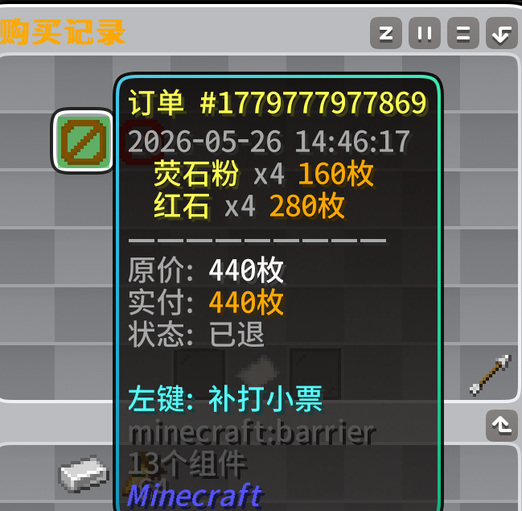
4. 玩家要耍赖皮，拿着小票来找麻烦怎么办？退款订单自动贴标，拒绝白嫖
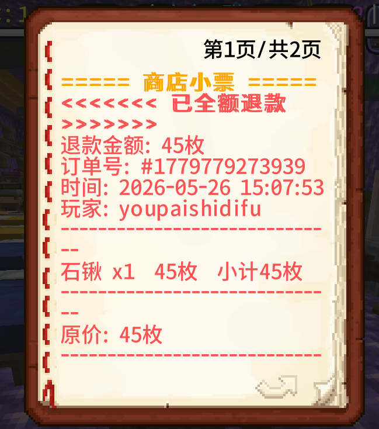<br>
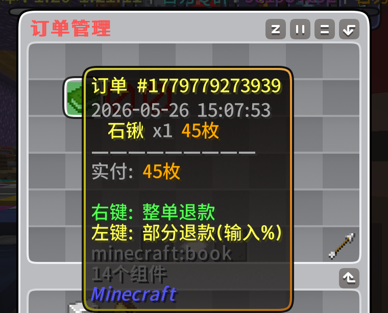
5. 想查看玩家消费记录？小手一点，明明白白<br>
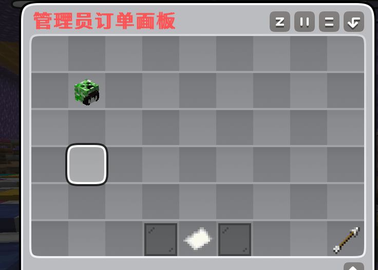


## 2.4 打印流水部分介绍
1. 管理员怀疑某个玩家刷钱了，怎么办？/printer 玩家名，一检查流水，很安心。很多人都刷了怎么办？/printer不加参数，一键导出全服流水，查他个底朝天<br>
2. 忘记删除怎么办？插件每分钟自动检测，旧文件超过24小时，自动删
  


## 3. 指令参数及介绍

- Sdf1_login 主指令<br>
- Sdf1_login reload 重载配置文件<br>
- reg 注册账号<br>
- login 登录账号<br>
- l 登录账号<br>
- sdf1_login del 删除玩家账号<br>
- sdf1_login radio 停止播放广播<br>
- sdf1_login radio reload 重载广播并重新打包资源包<br>
- menu 开/关 是否开启菜单<br>
- printer 打印流水数据，支持不带参数&带玩家名为参数<br>
- sdf1_login printer 作用同printer<br>
- sdf1_login shop 商城
- protect 区域防护


## 4. 自定义菜单物品
- 打开主界面，选择"我的"进入<br>
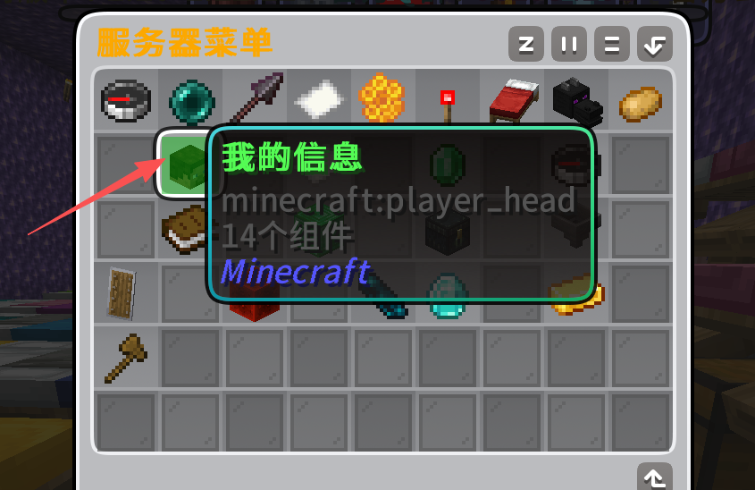
- 将你的自定义物品与雪球交换<br>
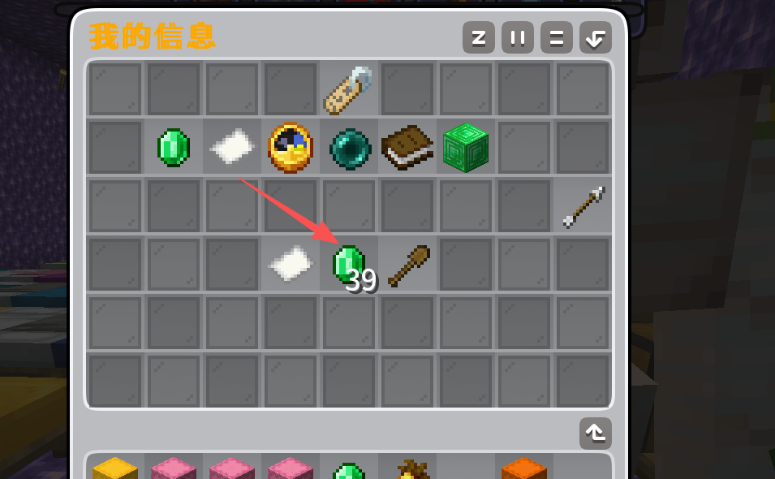
- 随后系统会给你重新发放菜单，并且此时图标就是你的自定义物品了

## 5. pvp战神榜
- 通过此功能，你可以在服务器里制作大服务器同款的击杀排行榜，而且能精准定位指定区域<br>
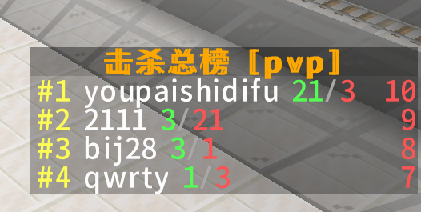
- 并且有着网游同款的击杀通报<br>

- 播报逻辑是：<br>
- 3杀<br>
- 5杀<br>
- 5杀以上每杀一次都是一条播报<br>
- 终结者通报，触发连杀的玩家被终结也会有全服通报

## 6. 区域防护
- 通过此功能，您可在服务器里需要防护的地方(比如展示框不想被玩家随便破坏、主城不准玩家袭击等)加以防护。<br>
- 还能够保护指定区域的玩家不受任何伤害。<br>

| 指令 | 参数1| 参数2 | 参数3 | 结果 |
| :---: | :---: | :---: | :---: |  :---: |
| protect | 无 |  无 | 无  | 帮助信息 |
| protect | add | 区域名 | 玩家名 |  加白指定玩家到区域 | 
| protect | add | 玩家名 | 无|  加白指定玩家为全局 | 
| protect | additem | 区域名 | 物品名 |  加黑指定物品到区域 | 
| protect | additem |  物品名 | 无 | 加黑指定物品到全局 | 
| protect | addname | 区域名 | 名字 | 加白指定生物名字到区域和平模式白名单 |
| protect | addplayer | 区域名 | 玩家名字 | 加白指定玩家到区域强制模式豁免名单 |
| protect | remove | 玩家名字 | 无 | 移除玩家为全白 |
| protect | remove | 区域名 | 玩家名 | 移除玩家为区白 |
| protect | removeitem | 物品名 | 无 | 删除指定物品为全黑
| protect | removeitem | 区域名 |  物品名 | 删除指定物品为区黑
| protect | removename | 区域名 | 名字 | 删除指定名字为区域和平模式白名单 |
| protect | removeplayer | 区域名 | 名字 | 删除指定玩家为强制模式豁免名单 |
| protect | 参数不分顺序 | 区名可以写这里也可以写后面 | 玩家名可以写这里也可以写前面 | 完美的宝宝化 |

示范：
- `/protect add 末地保护区 players` 添加players玩家到末地保护区<br>
- `/protect removeitem 主城区 TNT` 从主城删了TNT这个黑名单物品<br>
- `/protect 筑城区 addwhite zhangsan` 把zhangsan加白到主城区的模式豁免名单。<br>
- 所有参数`任意排序`，`区域名字`随便填写，强大的`兜底`会自动识别"宝宝画板"，你可以放心、大胆的乱写


| 参数 | 效果 |
| :---: | :---: |
| 和平模式 | 所有敌对生物全部进虚空 |
| 禁止袭击 | 立即清理玩家身上的袭击效果，传灾厄村民进虚空 |
| 清除XX效果 | 立即清除玩家身上的效果
| 给与xx效果 | 根据配置文件，给予玩家指定等级、时长的效果

## 生物属性对照表
| 中文名称 | 类型 | 附加属性 |
| :---: | :----: | :----: |
| 溺尸 | 近战/远程 | 亡灵、水生 |
| 骷髅 | 远程 | 亡灵 |
| 流浪者 | 远程 | 亡灵、寒冷群系变种 |
| 沼骸 | 远程 | 亡灵、沼泽变种 |
| 焦骸 | 远程 | 亡灵、沙漠变种、免疫阳光 |
| 掠夺者 | 远程 | 灾厄村民、袭击成员 |
| 卫道士 | 近战 | 灾厄村民、袭击成员 |
| 幻术师 | 远程 | 灾厄村民、Java专属、隐身分身 |
| 旋风人 | 远程 | 试炼密室生成、免疫弹射物、强击退 |
| 监守者 | 近战/声波远程 | 深暗之域、附带盲视效果 |
| 远古守卫者 | 近战/激光远程 | 海底神殿、水下、附加挖掘疲劳 |
| 守卫者 | 近战/激光远程 | 海底神殿、水下 |


配置文件解析：<br>
- 支持注释格式：`Java的//单行注释`、`yml的#单行注释`、`HTML的<!--- --->注释`和`Java/* */块注释`
```txt
# 区域: 主城区
起点: world,-130,-713
终点: world,-427,-560
高度范围: 0-255

没收物品: 蘑菇,毒蘑菇  #没收哪些物品(末地推荐这两个)
 // 禁止放置方块 #保护区内，非区白/全白玩家禁止放置方块
// 禁止破坏方块 # 同上
禁止PVP # 玩家之间不能PVP
禁止摔伤 # 摔落无法造成任何伤害
禁止饥饿 # 不会消耗饱食度
禁止一切伤害 # 任何怪物都无法造成伤害 
# 禁止丢弃物品
# 禁止末影珍珠
# 禁止使用弓箭
# 禁止骑乘
// 和平模式 // 所有的敌对生物全部传送进虚空
禁止袭击
禁止交互展示框 # 核心，任何玩家不能触碰展示框。区白/全白玩家除外
// 清除所有效果 # 清理所有负面效果
效果 村庄英雄 255 999999 # 给予玩家效果。格式为： 效果 效果名字 等级(最高255) 时间
效果 生命提升 255 999999
效果 抗性提升 255 999999
效果 抗火 255 999999
# 禁止药水
禁止爆炸
禁止使用物品: TNT
# 效果: 夜视 1 999
进入提示: 欢迎来到保护区 # 是否开启进入提示，即自定义提示
离开提示: 已离开保护区
 没收提示: 你的违禁品已被没收
 通报批评: §c§l{player} §f在{area}违规携带违禁品，被没收 §e{count}§f件！ # 通报违禁品。{player} 玩家名 {count}数量 {area}区域
# 惩罚命令: ban {player} 60s 违规


```

## php端说明：
1. 默认密码ypshidifu2026<br>
2. 工单系统全面支持markdown语法：
```md
# 一级标题
## 二级标题
### 三级标题
#### 四级标题
##### 五级标题
###### 六级标题

表格语法

| 表格列1 | 表格列2 |
| --- | --- |
| 表格1 | 表格2 |

>单嵌套语法

>嵌套块
>
>>语法

 图片语法
[]() 超链接语法
<br>换行语法
代码块语法
```
## 工单状态：

|  状态名 | 是否可回复 | 备注说明 |
| :---: | :---: | :---: |
| 已提交 | 可回复 | 初始化状态 |
| 已回复 | 可回复 | 玩家自己回复了/管理员/服务商回复了 |
| 已完结 | 不可回复 | 管理员驳回了工单请求 |
| 已撤销 | 不可回复 | 用户撤销了工单请求 |

## 服务商说明
- 若您需要授权某个玩家为服务商，请登录游戏，打开工单系统-管理面板-添加服务商，然后输入他的名字即可邀请服务商


## 运行截图

主界面
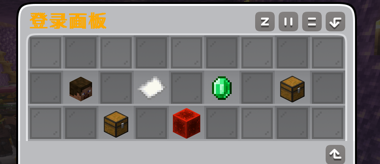

邀请数据
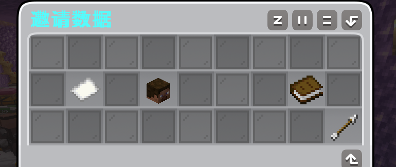

积分商店
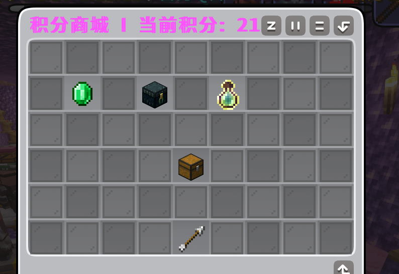

任务中心
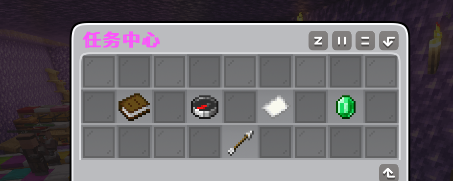

垃圾箱
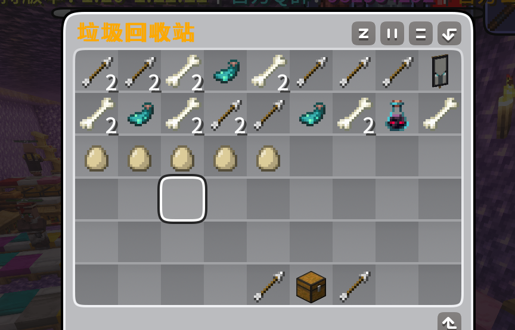

管理员面板
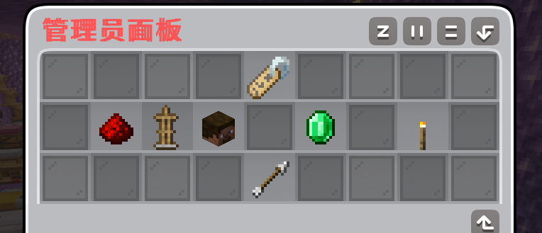

管理面板-用户管理
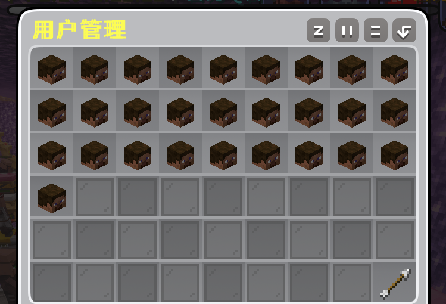


工单中心
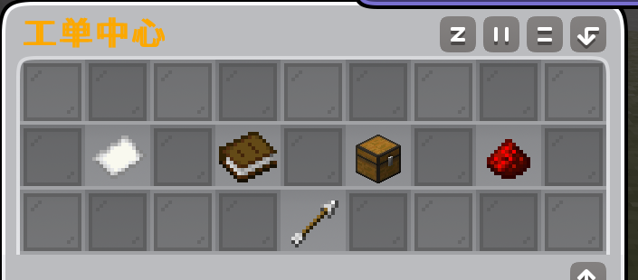

工单管理
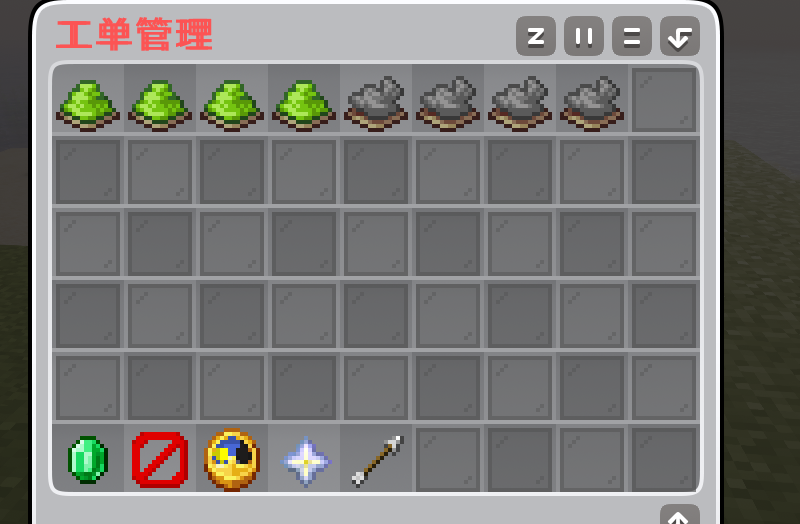

我的工单
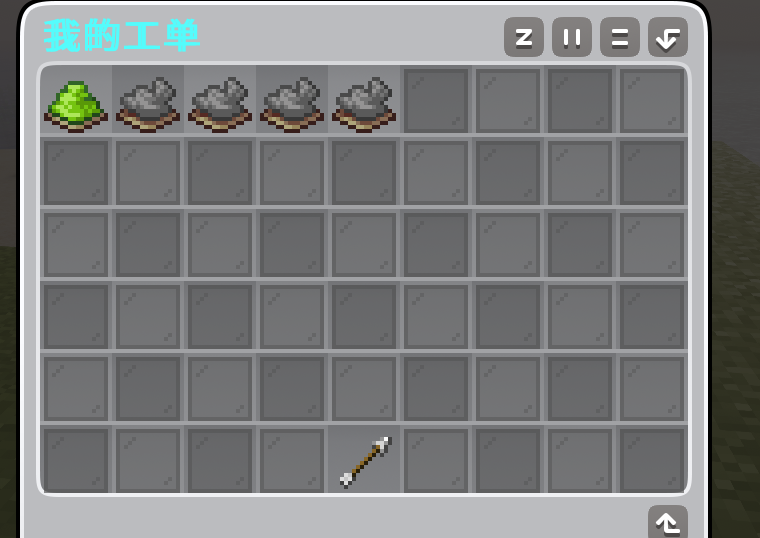


提交工单
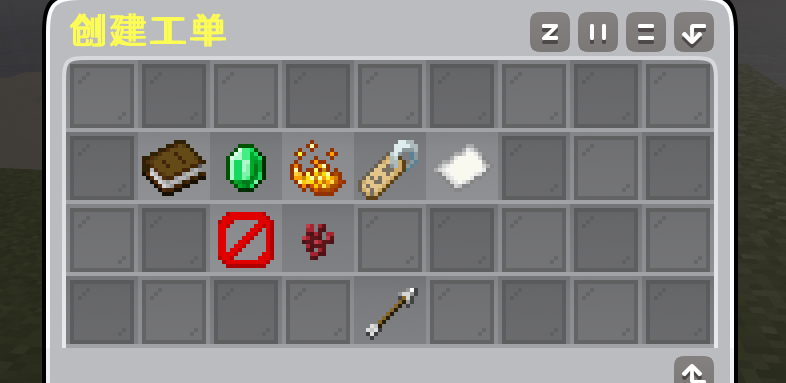

服务商列表
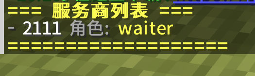

服务商抢单大厅
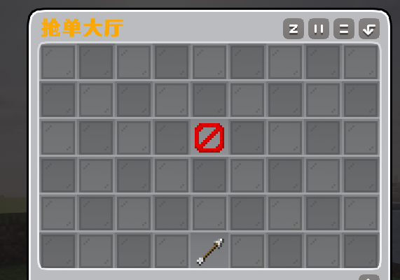

服务商-接单界面
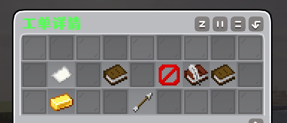

管理员-工单详情页面
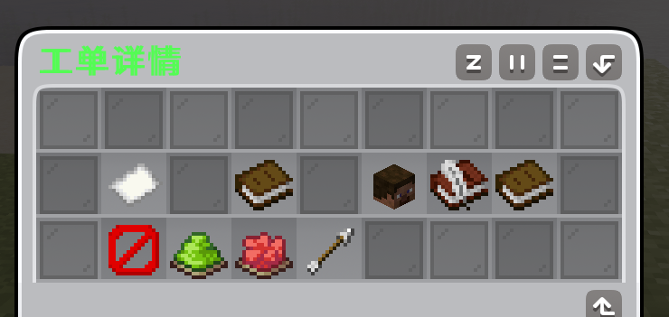

商城主界面
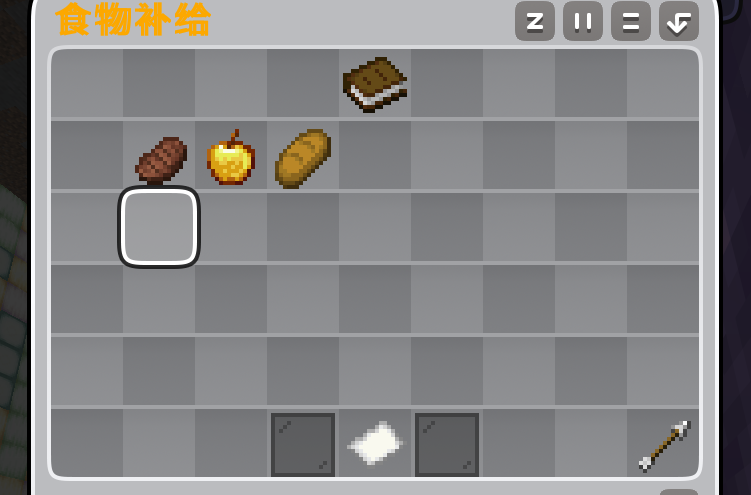

商城购物车
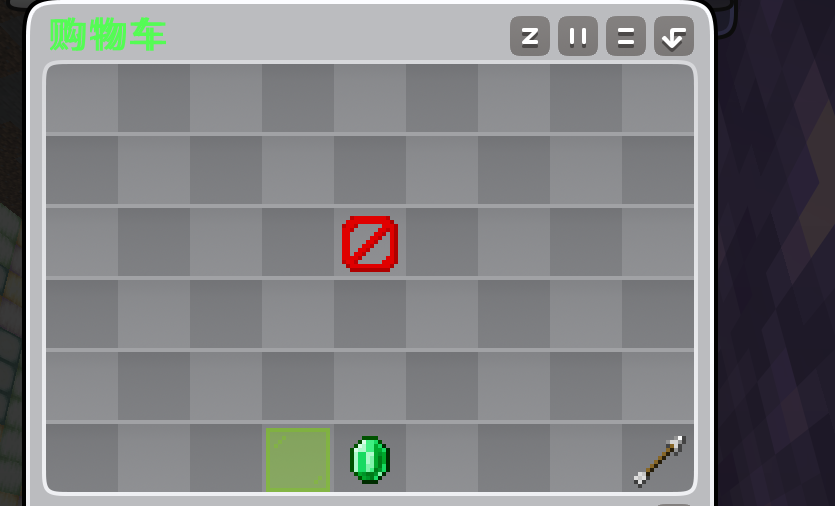

商城退单
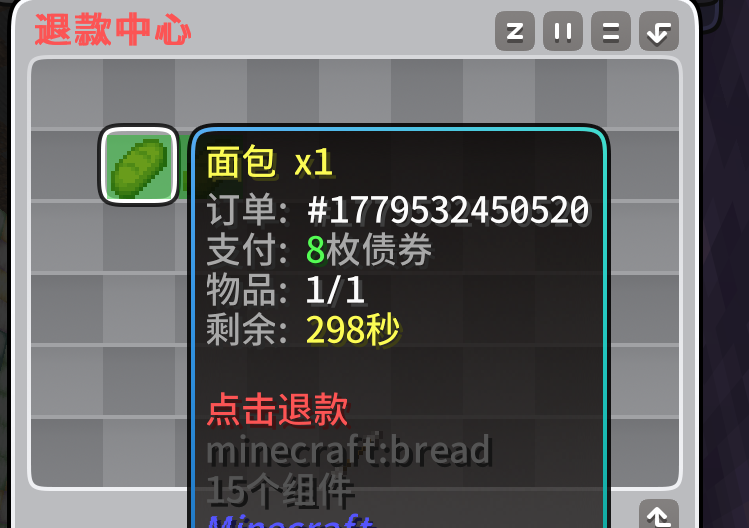

## 4. 下载地址
- 官方文档：[https://wiki.ypshidifu.cn](https://wiki.ypshidifu.cn) (推荐)
- GitHub：[https://github.com/ypsdf1/sdf1_login](https://github.com/ypsdf1/sdf1_login)
- Gitee：[https://gitee.com/nihaoshidifu/sdf1_login](https://gitee.com/nihaoshidifu/sdf1_login)
- gitcode: [https://gitcode.com/ypsdf1/Sdf1_login](https://gitcode.com/ypsdf1/Sdf1_login)
